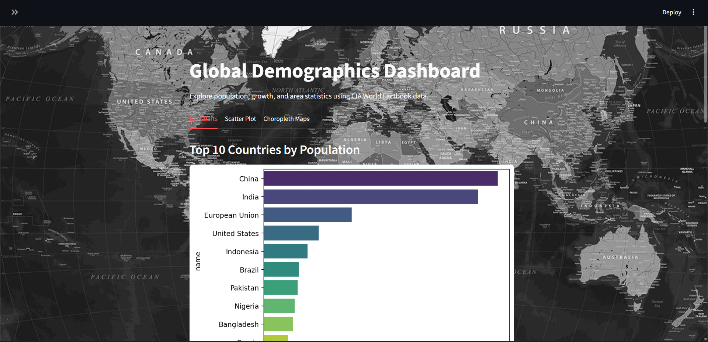
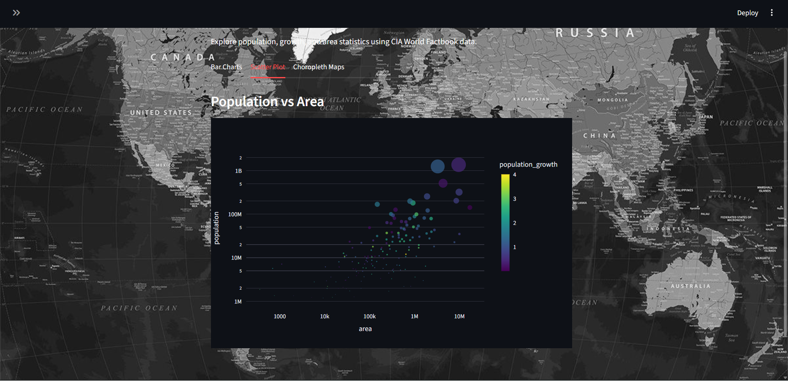

# CIA Factbook Dashboard


## **Project Overview**

The **CIA Factbook Dashboard** is an interactive data visualization project that analyzes global demographics using the **CIA World Factbook dataset**. It provides insights into population, population growth, land area, and other key demographic indicators across countries. The dashboard is built with **Python**, **Streamlit**, and **SQL**, enabling users to explore and visualize data efficiently.

---

## **Features**

- **Data Exploration**: Filter countries by population, area, and population growth rate.
- **Interactive Visualizations**:
  - **Bar Charts**: Top 10 countries by population, area, and fastest-growing populations.
  - **Scatter Plots**: Show relationship between population and area; detect outliers like Monaco and Mongolia.
  - **Choropleth Maps**: Interactive maps showing population, area, and population growth globally.
- **Download Option**: Export filtered datasets as CSV directly from the dashboard.
- **Customizable UI**: Professional look with background images and sidebar filters.

---

## **Technology Stack**

- **Programming Language**: Python 3.x  
- **Framework**: Streamlit  
- **Libraries**: Pandas, Plotly, Matplotlib, Seaborn  
- **Database**: SQLite (`factbook.db`)

---

## **Installation & Setup**

1. **Clone the repository**

```bash
git clone https://github.com/amarssingh/CIA_Factbook_Dashboard.git
cd CIA_Factbook_Dashboard
```

2. **Install dependencies**

```
pip install -r requirements.txt
```

3. **Run the dashboard**

```
streamlit run dashboard.py
```

---

## Usage Instructions

1. **Use the sidebar filters to select ranges for:**

 - **Population**

 - **Area**

 - **Population Growth (%)**

2. **Visualizations will update automatically according to your filter selection.**

3. **Click the Download CSV button to save the filtered data.**

4. **Explore bar charts, scatter plots, and choropleth maps for interactive insights.**
 
---

## Folder Structure
```
CIA_Factbook_Dashboard/
│
├── dashboard.py         # Main Streamlit dashboard code
├── factbook.db          # SQLite database file
├── background.jpg       # Background image for dashboard
├── requirements.txt     # Required Python packages
└── README.md            # Project documentation
```

---

## Project Goals

- **Learn SQL querying and data analysis on real-world datasets.**

- **Develop interactive visualizations for global demographic insights.**

- **Create a presentation-ready dashboard for professional data storytelling.**

---

## Screenshots

### Bar Chart - Top 10 Countries by Population


### Scatter Plot - Population vs Area


### Choropleth Map - World Population


--- 

## Author

## **Amar Singh**

GitHub: https://github.com/amarssingh

LinkedIn: https://www.linkedin.com/in/amarssingh-in
